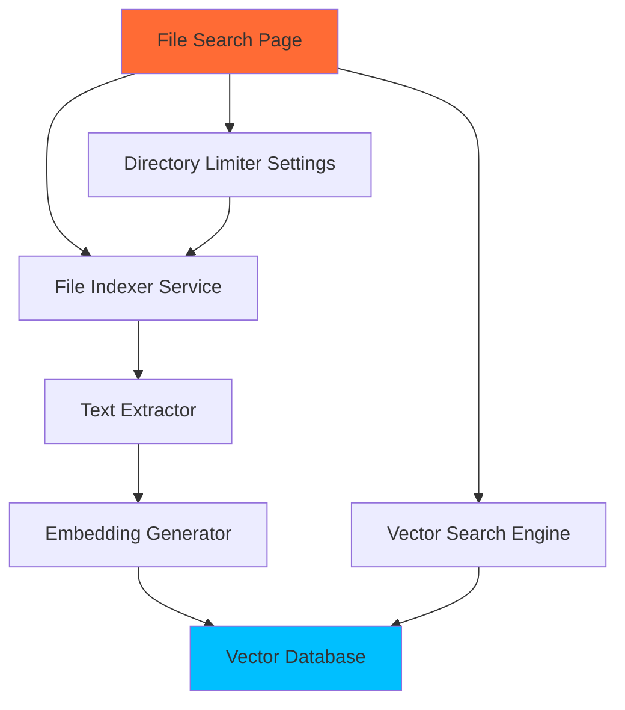

# RAG-Powered Local System Search Implementation Roadmap

## Executive Summary

This roadmap outlines the implementation of a Retrieval-Augmented Generation (RAG) powered local file search system for DinoAir 2.0. The system will enable semantic search across local files with directory limiting capabilities, vector embeddings, and integration with the existing DinoAir architecture.

## Architecture Overview



---

## Phase 1: Database Schema & Infrastructure (3-4 days)

### Priority: Critical
### Dependencies: None

### Deliverables:
1. **Vector storage schema in SQLite**
   - File: `src/database/initialize_db.py` (modify)
   - New table: `file_embeddings`
   - Schema design for vector storage with SQLite JSON support
   
2. **File indexing metadata schema**
   - New table: `indexed_files`
   - Track file paths, sizes, last modified, index status
   
3. **Database access layer**
   - New file: `src/database/file_search_db.py`
   - CRUD operations for file embeddings and metadata
   - Integration with ResilientDB wrapper

### Testing Requirements:
- Unit tests for database operations
- Schema migration tests
- Performance tests for vector storage/retrieval

### Security Considerations:
- Path traversal prevention in file access
- Sanitization of file paths before storage

---

## Phase 2: Text Extraction System (2-3 days)

### Priority: Critical
### Dependencies: Phase 1

### Deliverables:
1. **Multi-format text extractor**
   - New file: `src/utils/text_extractor.py`
   - Support for: .txt, .md, .py, .js, .html, .json, .csv
   - PDF extraction using PyPDF2 (local library)
   - DOCX extraction using python-docx
   
2. **File type detection and routing**
   - MIME type detection
   - Configurable extraction strategies
   
3. **Content chunking system**
   - New file: `src/utils/text_chunker.py`
   - Sliding window chunking with overlap
   - Configurable chunk size (default: 512 tokens)

### Testing Requirements:
- Test files for each supported format
- Edge case handling (corrupted files, empty files)
- Performance benchmarks for large files

---

## Phase 3: Local Embedding Generation (4-5 days)

### Priority: Critical
### Dependencies: Phase 2

### Deliverables:
1. **Local embedding model integration**
   - New file: `src/models/embedding_generator.py`
   - Use Sentence Transformers with local model
   - Model: all-MiniLM-L6-v2 (lightweight, 80MB)
   - Batch processing capabilities
   
2. **Embedding cache system**
   - Cache embeddings to avoid recomputation
   - LRU cache implementation
   
3. **Model management**
   - New file: `src/utils/model_manager.py`
   - Download and cache models locally
   - Model versioning support

### Testing Requirements:
- Embedding quality tests
- Performance benchmarks
- Memory usage monitoring

---

## Phase 4: Vector Search Engine (3-4 days)

### Priority: Critical
### Dependencies: Phase 3

### Deliverables:
1. **Vector similarity search**
   - New file: `src/search/vector_search.py`
   - Cosine similarity implementation
   - K-nearest neighbors search
   - Hybrid search (keyword + semantic)
   
2. **Search result ranking**
   - BM25 for keyword relevance
   - Vector similarity scoring
   - Combined ranking algorithm
   
3. **Search API interface**
   - New file: `src/search/search_api.py`
   - Unified search interface
   - Result pagination support

### Testing Requirements:
- Search accuracy tests
- Performance tests with large datasets
- Relevance ranking validation

---

## Phase 5: File Indexing Service (3-4 days)

### Priority: High
### Dependencies: Phases 1-4

### Deliverables:
1. **Background indexing service**
   - New file: `src/services/file_indexer.py`
   - Asynchronous file processing
   - Progress tracking and reporting
   - Incremental indexing support
   
2. **File system watcher**
   - Monitor file changes
   - Automatic re-indexing
   - Configurable watch directories
   
3. **Indexing queue management**
   - Priority queue for files
   - Batch processing optimization
   - Resource usage controls

### Testing Requirements:
- Concurrent indexing tests
- File change detection tests
- Queue management tests

---

## Phase 6: GUI Implementation (4-5 days)

### Priority: High
### Dependencies: Phases 1-5

### Deliverables:
1. **Enhanced FileSearchPage**
   - File: `src/gui/pages/file_search_page.py` (complete implementation)
   - Search interface with DinoAir styling
   - Directory browser/selector
   - Search results display with snippets
   
2. **Search result widget**
   - New file: `src/gui/components/file_search_results.py`
   - File preview with highlighted matches
   - Click to open file functionality
   - Export search results
   
3. **Indexing status widget**
   - New file: `src/gui/components/indexing_status.py`
   - Progress bars for indexing
   - File count and status display
   - Pause/resume controls

### Testing Requirements:
- GUI interaction tests
- Responsive design tests
- User experience validation

---

## Phase 7: Directory Limiter Integration (2-3 days)

### Priority: High
### Dependencies: Phase 6

### Deliverables:
1. **Settings page integration**
   - File: `src/gui/pages/settings_page.py` (modify)
   - Directory selection UI
   - Include/exclude patterns
   - Max file size limits
   
2. **Directory configuration storage**
   - Store in app_config.json
   - Default directories setup
   - Validation and sanitization
   
3. **Access control implementation**
   - Enforce directory limits in indexer
   - Path validation utilities
   - Security warnings for sensitive directories

### Testing Requirements:
- Directory access tests
- Configuration persistence tests
- Security boundary tests

---

## Phase 8: Testing & Polish (3-4 days)

### Priority: High
### Dependencies: All phases

### Deliverables:
1. **Comprehensive test suite**
   - Integration tests for full workflow
   - Performance benchmarks
   - Security penetration tests
   
2. **Documentation**
   - User guide for file search
   - API documentation
   - Configuration guide
   
3. **Performance optimization**
   - Query optimization
   - Memory usage optimization
   - Indexing speed improvements
   
4. **Error handling & recovery**
   - Graceful degradation
   - Error reporting UI
   - Recovery mechanisms

### Testing Requirements:
- End-to-end testing
- Stress testing with large file sets
- User acceptance testing

---

## Technical Stack

### Required Python Libraries (all local):
```python
# requirements.txt additions
sentence-transformers==2.2.2  # Local embeddings
faiss-cpu==1.7.4             # Vector similarity search
PyPDF2==3.0.1                # PDF text extraction
python-docx==0.8.11          # DOCX text extraction
watchdog==3.0.0              # File system monitoring
numpy==1.24.3                # Vector operations
```

### File Structure:
```
src/
├── database/
│   └── file_search_db.py (new)
├── models/
│   └── embedding_generator.py (new)
├── search/
│   ├── __init__.py (new)
│   ├── vector_search.py (new)
│   └── search_api.py (new)
├── services/
│   ├── __init__.py (new)
│   └── file_indexer.py (new)
├── utils/
│   ├── text_extractor.py (new)
│   ├── text_chunker.py (new)
│   └── model_manager.py (new)
└── gui/
    ├── pages/
    │   └── file_search_page.py (modify)
    └── components/
        ├── file_search_results.py (new)
        └── indexing_status.py (new)
```

---

## Time Estimates

- **Total Development Time**: 25-32 days
- **Critical Path**: Phases 1-4 (12-16 days)
- **Parallel Development Possible**: Phases 6-7 can start after Phase 4

---

## Risk Mitigation

1. **Performance Risks**
   - Mitigation: Implement caching, batch processing, and lazy loading
   - Fallback: Limit initial indexing scope

2. **Memory Usage**
   - Mitigation: Stream processing for large files
   - Fallback: File size limits

3. **Security Risks**
   - Mitigation: Strict path validation, sandboxing
   - Fallback: Whitelist-only directory access

---

## Success Metrics

1. **Performance Targets**
   - Index 1000 files in < 5 minutes
   - Search response time < 500ms
   - Memory usage < 500MB for typical usage

2. **Quality Targets**
   - Search relevance > 80% accuracy
   - Zero security vulnerabilities
   - 95% test coverage

3. **User Experience**
   - Intuitive UI matching DinoAir design
   - Clear progress feedback
   - Helpful error messages

---

## Next Steps

1. Review and approve roadmap
2. Set up development environment with required libraries
3. Create feature branch for development
4. Begin Phase 1 implementation

This roadmap provides a clear path to implementing a robust, secure, and performant local file search system that integrates seamlessly with DinoAir 2.0's existing architecture.