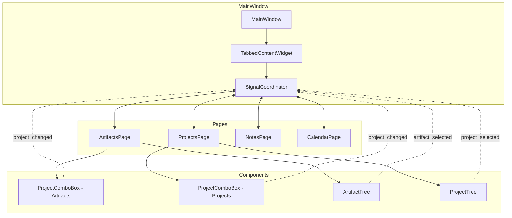
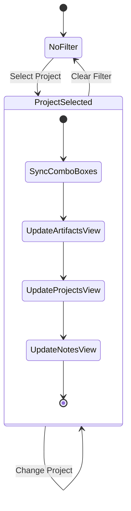
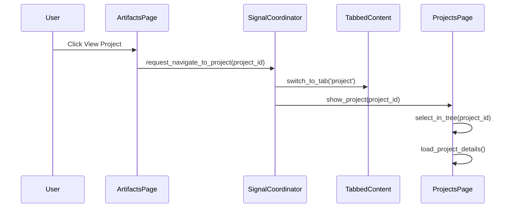
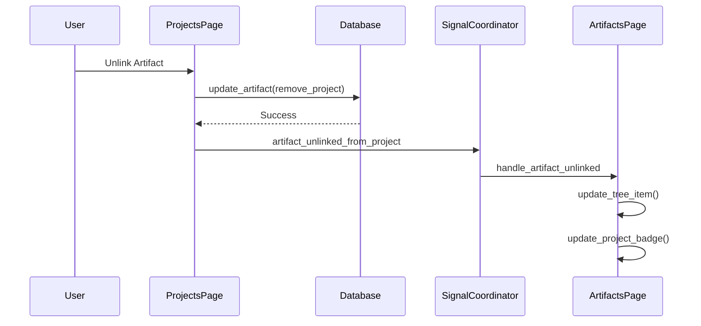

# Signal-Based Coordination System for GUI Integration
## DinoAir 2.0 - Artifacts and Projects Synchronization

### Overview
This document outlines the architecture for a signal-based coordination system that enables real-time synchronization and cross-page navigation between the Artifacts and Projects pages in DinoAir 2.0.

### Architecture Components

#### 1. Signal Flow Architecture



#### 2. Signal Definitions

##### Core Signals

```python
# In SignalCoordinator class
class SignalCoordinator(QObject):
    # Cross-page navigation signals
    navigate_to_artifact = Signal(str)  # artifact_id
    navigate_to_project = Signal(str)   # project_id
    navigate_to_note = Signal(str)      # note_id
    navigate_to_event = Signal(str)     # event_id
    
    # Project filter synchronization
    project_filter_changed = Signal(str)  # project_id or None
    
    # Real-time update signals
    artifact_linked_to_project = Signal(str, str)    # artifact_id, project_id
    artifact_unlinked_from_project = Signal(str, str) # artifact_id, project_id
    project_updated = Signal(str)                     # project_id
    artifact_updated = Signal(str)                    # artifact_id
    
    # Batch update signals
    artifacts_batch_updated = Signal(list)  # List of artifact_ids
    projects_batch_updated = Signal(list)   # List of project_ids
```

##### Page-Specific Signals

```python
# In ArtifactsPage
class ArtifactsPage(QWidget):
    # Existing signals
    artifact_selected = Signal(Artifact)
    
    # New signals for coordination
    request_navigate_to_project = Signal(str)  # project_id
    project_filter_requested = Signal(str)     # project_id
    artifact_project_changed = Signal(str, str, str)  # artifact_id, old_project_id, new_project_id

# In ProjectsPage
class ProjectsPage(QWidget):
    # Existing signals
    project_selected = Signal(Project)
    
    # New signals for coordination
    request_navigate_to_artifact = Signal(str)  # artifact_id
    request_navigate_to_note = Signal(str)      # note_id
    request_navigate_to_event = Signal(str)     # event_id
```

#### 3. Signal Routing Architecture

##### SignalCoordinator Class Design

```python
class SignalCoordinator(QObject):
    """Central coordinator for cross-page signals and state synchronization"""
    
    def __init__(self, tabbed_content: TabbedContentWidget):
        super().__init__()
        self.tabbed_content = tabbed_content
        self.pages = {}  # Dict[str, QWidget]
        self.current_project_filter = None
        self._setup_page_connections()
    
    def register_page(self, page_id: str, page_widget: QWidget):
        """Register a page for signal coordination"""
        self.pages[page_id] = page_widget
        self._connect_page_signals(page_id, page_widget)
    
    def _connect_page_signals(self, page_id: str, page_widget: QWidget):
        """Connect signals from a specific page"""
        # Implementation based on page type
        pass
    
    def _route_navigation_request(self, target_page: str, item_id: str):
        """Route navigation request to appropriate page"""
        # Switch to target tab
        # Call appropriate method on target page
        pass
```

#### 4. State Synchronization Strategy

##### Project Filter State Management



##### Implementation Pattern

```python
class FilterStateManager:
    """Manages synchronized filter state across pages"""
    
    def __init__(self):
        self.current_project_id = None
        self.subscribers = []  # List of pages/widgets
    
    def set_project_filter(self, project_id: Optional[str]):
        """Update project filter and notify subscribers"""
        if self.current_project_id != project_id:
            self.current_project_id = project_id
            self._notify_subscribers(project_id)
    
    def subscribe(self, widget: QWidget):
        """Subscribe a widget to filter state changes"""
        self.subscribers.append(widget)
    
    def _notify_subscribers(self, project_id: Optional[str]):
        """Notify all subscribers of filter change"""
        for subscriber in self.subscribers:
            if hasattr(subscriber, 'apply_project_filter'):
                subscriber.apply_project_filter(project_id)
```

#### 5. Visual Enhancement Specifications

##### Project Badges in Artifact Tree

```python
class ProjectBadgeDelegate(QStyledItemDelegate):
    """Custom delegate for showing project badges in artifact tree"""
    
    def paint(self, painter, option, index):
        # Draw standard item
        super().paint(painter, option, index)
        
        # Get artifact data
        artifact = index.data(Qt.UserRole)
        if artifact and hasattr(artifact, 'project_id'):
            # Draw project badge
            badge_rect = self._calculate_badge_rect(option.rect)
            self._draw_project_badge(painter, badge_rect, artifact.project_id)
```

##### Visual Indicators Design

1. **Project Badge Colors**: Use project's custom color or default orange
2. **Badge Position**: Right side of artifact name
3. **Badge Content**: Project icon + abbreviated name
4. **Hover Effect**: Show full project name tooltip
5. **Click Action**: Navigate to project

#### 6. Cross-Page Navigation Flow



#### 7. Real-Time Update Flow



#### 8. Implementation Priority

1. **Phase 1 - Core Infrastructure**
   - SignalCoordinator class
   - Basic signal definitions
   - Page registration mechanism

2. **Phase 2 - Cross-Page Navigation**
   - Navigation signal handlers
   - Tab switching logic
   - Item selection methods

3. **Phase 3 - Filter Synchronization**
   - FilterStateManager
   - Project combo box sync
   - View updates

4. **Phase 4 - Real-Time Updates**
   - Link/unlink signals
   - Database change notifications
   - UI refresh logic

5. **Phase 5 - Visual Enhancements**
   - Project badges
   - Custom delegates
   - Hover effects

#### 9. Signal Debugging & Monitoring

```python
class SignalDebugger:
    """Debug and monitor signal flow"""
    
    def __init__(self, coordinator: SignalCoordinator):
        self.coordinator = coordinator
        self.signal_log = []
        self._connect_debug_slots()
    
    def log_signal(self, signal_name: str, args: tuple):
        """Log signal emission with timestamp"""
        entry = {
            'timestamp': datetime.now(),
            'signal': signal_name,
            'args': args,
            'stack_trace': self._get_stack_trace()
        }
        self.signal_log.append(entry)
        
        if self.debug_mode:
            print(f"[SIGNAL] {signal_name}({args})")
```

#### 10. Error Handling & Recovery

```python
class SignalErrorHandler:
    """Handle errors in signal processing"""
    
    def __init__(self):
        self.error_count = {}
        self.max_retries = 3
    
    def handle_signal_error(self, signal_name: str, error: Exception):
        """Handle signal processing errors gracefully"""
        self.error_count[signal_name] = self.error_count.get(signal_name, 0) + 1
        
        if self.error_count[signal_name] < self.max_retries:
            # Retry with delay
            QTimer.singleShot(100, lambda: self.retry_signal(signal_name))
        else:
            # Log error and notify user
            self.logger.error(f"Signal {signal_name} failed: {error}")
            self.show_error_notification(signal_name, error)
```

### Configuration

#### Signal Coordinator Settings

```json
{
    "signal_coordination": {
        "enable_debug_mode": false,
        "signal_timeout_ms": 5000,
        "batch_update_delay_ms": 100,
        "max_signal_retries": 3,
        "enable_signal_logging": true,
        "log_retention_days": 7
    }
}
```

### Benefits

1. **Decoupled Architecture**: Pages don't directly reference each other
2. **Scalable**: Easy to add new pages and signals
3. **Maintainable**: Central coordination point
4. **Debuggable**: Built-in signal monitoring
5. **Performant**: Batch updates and smart refresh
6. **User-Friendly**: Seamless cross-page navigation

### Testing Strategy

1. **Unit Tests**: Test individual signal handlers
2. **Integration Tests**: Test cross-page workflows
3. **Performance Tests**: Measure signal latency
4. **UI Tests**: Verify visual updates
5. **Error Tests**: Test error recovery mechanisms