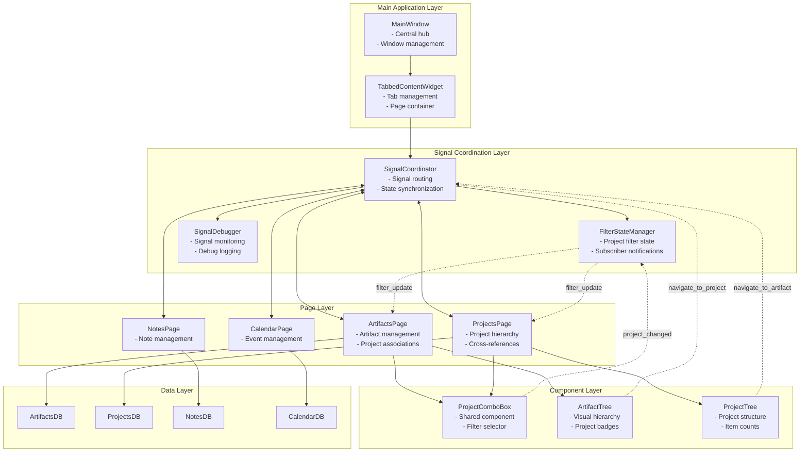
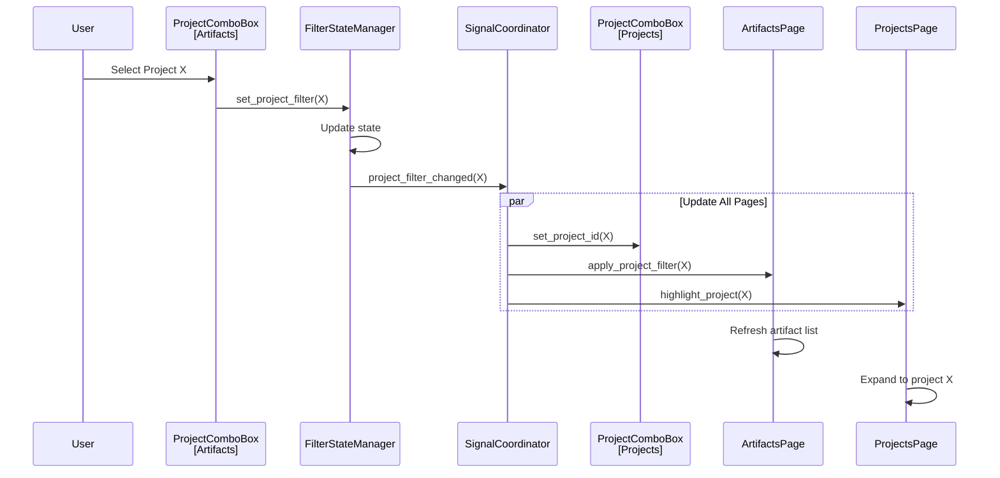
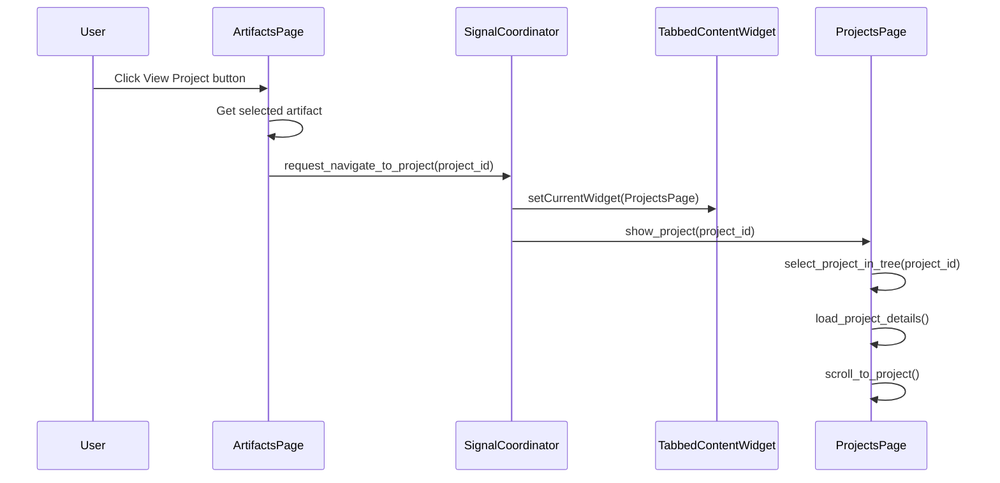
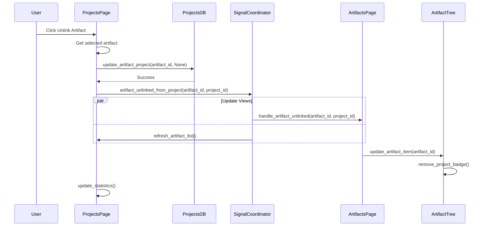
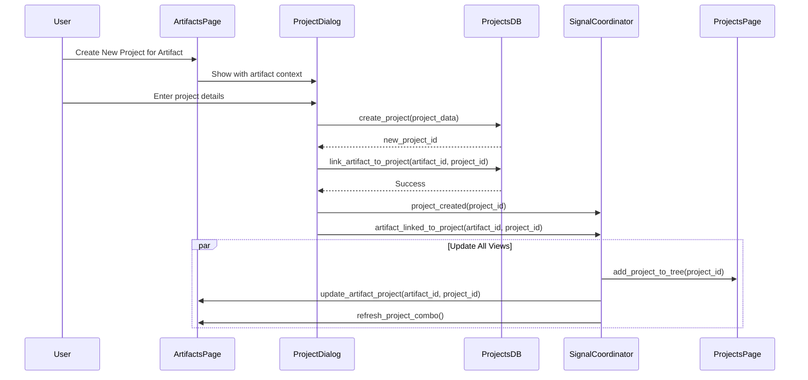
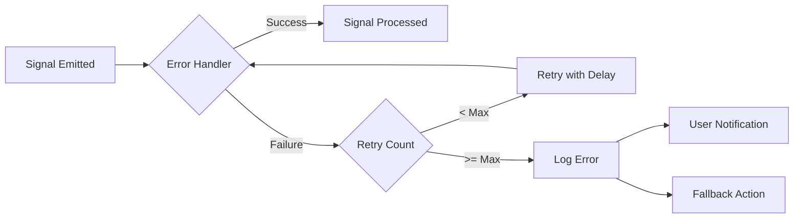

# Signal Flow Diagram - Complete Architecture

## Complete Signal Flow Architecture

## Key Signal Flows

### 1. Project Filter Synchronization

### 2. Cross-Page Navigation - Artifact to Project

### 3. Real-Time Artifact Unlinking

### 4. Project Creation with Artifact Association

## Signal Types and Priorities

### High Priority Signals (Immediate)
- Navigation requests
- Filter changes
- User-initiated actions

### Medium Priority Signals (Batched)
- Multiple item updates
- Statistics refresh
- Tree expansions

### Low Priority Signals (Deferred)
- Background sync
- Auto-save triggers
- Debug logging

## Error Handling Flow

## Performance Considerations

1. **Batch Updates**: Group multiple updates within 100ms window
2. **Lazy Loading**: Only update visible items in trees
3. **Debouncing**: Filter changes debounced by 300ms
4. **Caching**: Project/artifact relationships cached in memory
5. **Async Operations**: Database queries run in separate thread

## Testing Scenarios

### Scenario 1: Filter Sync Test
1. Set filter in Artifacts page
2. Verify Projects page combo box updates
3. Verify filtered views in both pages
4. Clear filter and verify reset

### Scenario 2: Navigation Test
1. Select artifact with project
2. Navigate to project
3. Verify correct project selected
4. Navigate back to artifact
5. Verify artifact still selected

### Scenario 3: Real-time Update Test
1. Open both pages side-by-side
2. Link artifact to project
3. Verify badge appears immediately
4. Unlink artifact
5. Verify badge removed immediately

### Scenario 4: Error Recovery Test
1. Simulate database error
2. Verify retry mechanism
3. Verify user notification
4. Verify system recovers gracefully