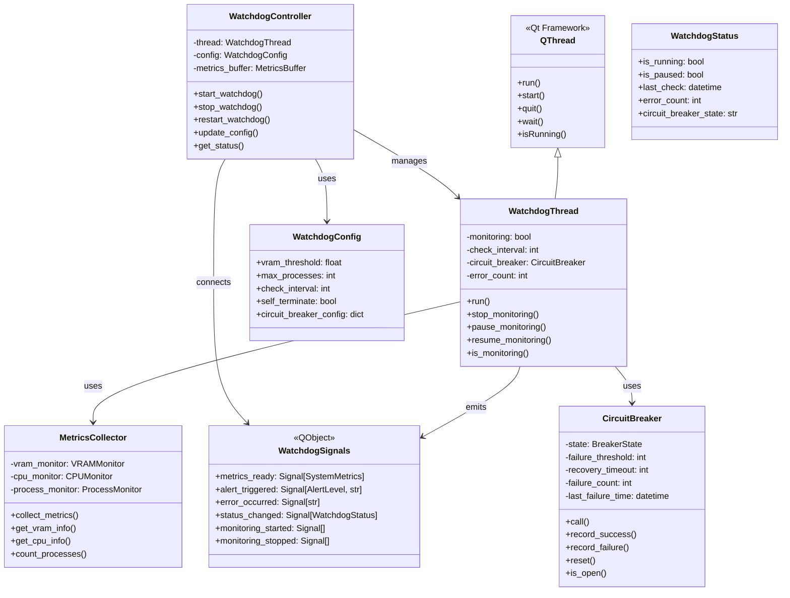
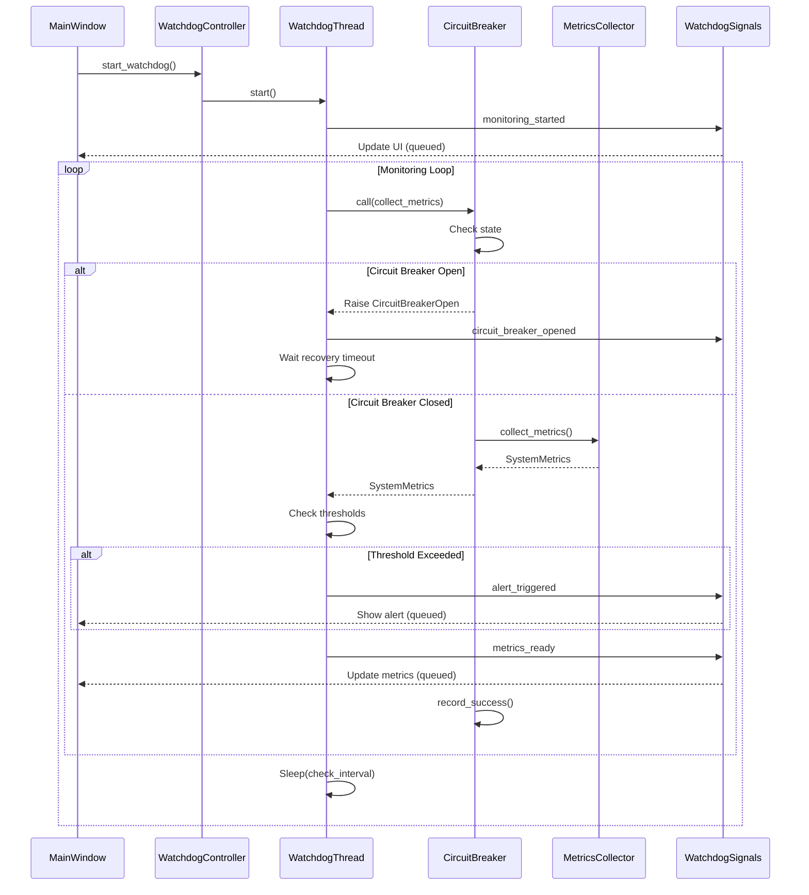
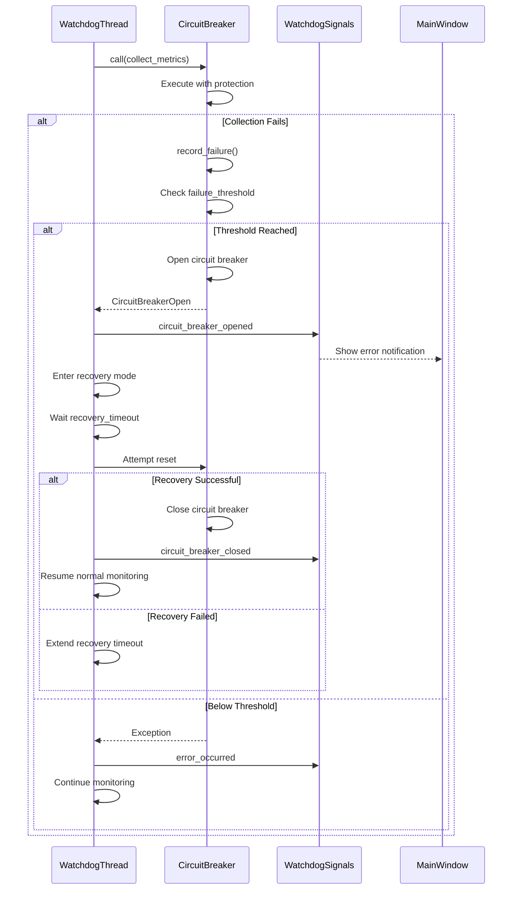
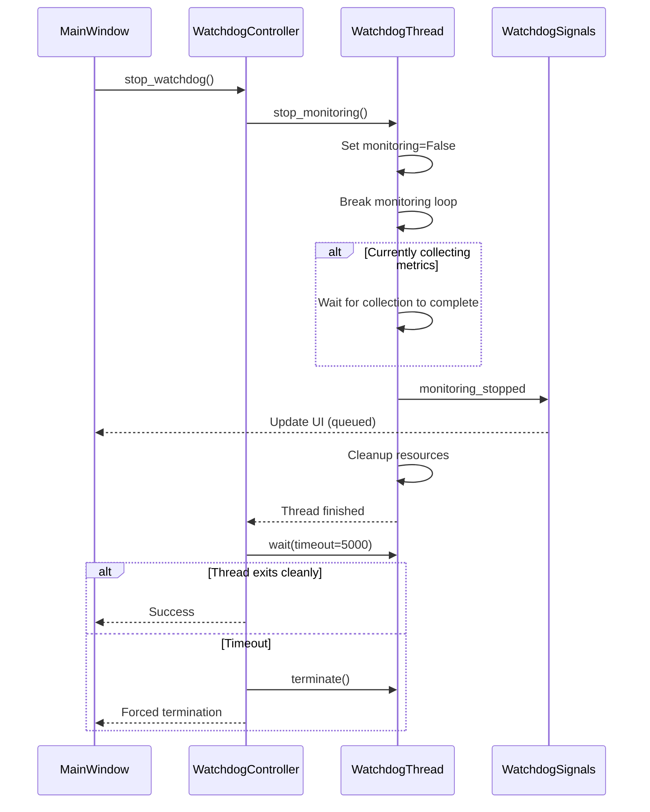
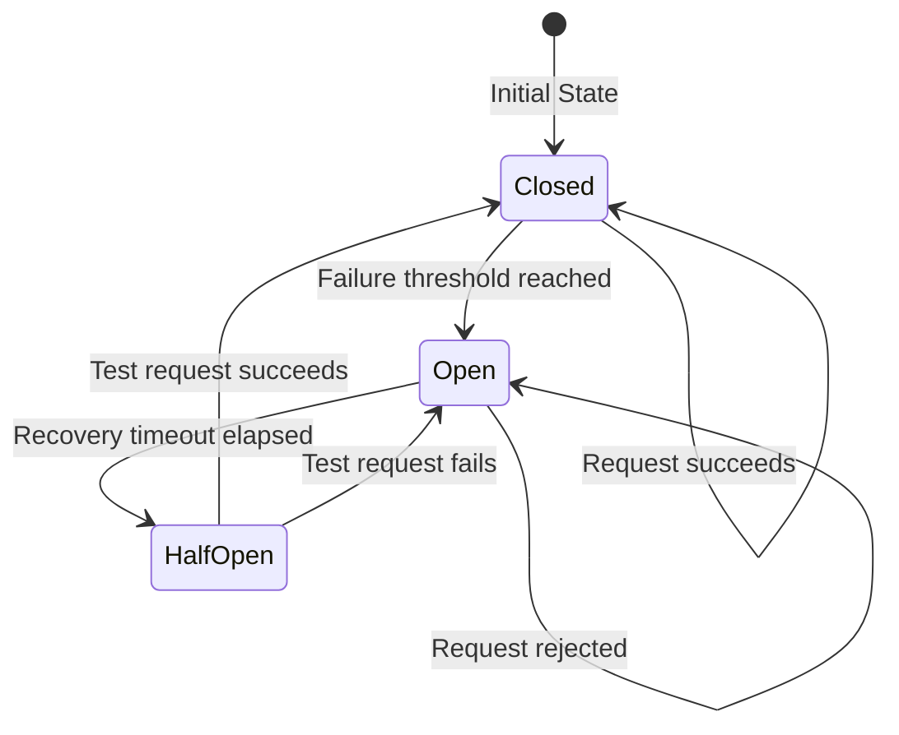

# Qt-Compatible Threading Architecture for DinoAir 2.0 Watchdog System

## Executive Summary

This document presents a comprehensive architectural design to replace the current ThreadPoolExecutor-based watchdog implementation with a Qt-compatible QThread-based architecture. This resolves the threading conflicts that cause "QBasicTimer can only be used with threads started with QThread" errors while maintaining all current monitoring capabilities.

## Problem Analysis

### Current Issues
1. **Threading Conflict**: ThreadPoolExecutor creates standard Python threads that are incompatible with Qt's event loop
2. **Unsafe GUI Updates**: Direct callbacks from non-Qt threads can cause race conditions
3. **No Circuit Breaker**: Current implementation lacks protection against cascading failures
4. **Limited Error Recovery**: No automatic recovery mechanism for monitoring failures

### Current Implementation Overview
- Uses `concurrent.futures.ThreadPoolExecutor` for background monitoring
- Direct callbacks to GUI from worker thread
- Monitors: VRAM usage, CPU/RAM usage, DinoAir process count
- Emergency shutdown capability for runaway processes

## Proposed Architecture

### Core Design Principles
1. **Qt-Native Threading**: All background operations use QThread
2. **Signal/Slot Communication**: Thread-safe communication via Qt signals
3. **Graceful Degradation**: Circuit breaker pattern prevents cascading failures
4. **Automatic Recovery**: Self-healing mechanisms for transient failures
5. **Zero GUI Blocking**: All operations are fully asynchronous

## Class Architecture



## Signal/Slot Interface Design

### Signal Definitions

```python
class WatchdogSignals(QObject):
    """Qt signals for thread-safe communication"""
    
    # Metrics updates
    metrics_ready = Signal(SystemMetrics)  # Regular metrics updates
    
    # Alert notifications
    alert_triggered = Signal(AlertLevel, str)  # Alert level and message
    
    # Error handling
    error_occurred = Signal(str)  # Error message
    circuit_breaker_opened = Signal(str)  # Reason for opening
    circuit_breaker_closed = Signal()  # Circuit breaker recovered
    
    # Status updates
    status_changed = Signal(WatchdogStatus)  # Overall status
    monitoring_started = Signal()
    monitoring_stopped = Signal()
    monitoring_paused = Signal()
    monitoring_resumed = Signal()
    
    # Process management
    cleanup_started = Signal(int)  # Number of processes to clean
    cleanup_completed = Signal(dict)  # Cleanup results
    emergency_shutdown_initiated = Signal(str)  # Reason
```

### Connection Pattern

```python
# In MainWindow or Controller
watchdog_controller.signals.metrics_ready.connect(
    self.metrics_widget.update_metrics, 
    Qt.QueuedConnection  # Ensures thread-safe GUI updates
)

watchdog_controller.signals.alert_triggered.connect(
    self.notification_widget.add_notification,
    Qt.QueuedConnection
)
```

## Sequence Diagrams

### Monitoring Loop Sequence



### Error Handling Sequence



### Graceful Shutdown Sequence



## Circuit Breaker Pattern Implementation

### State Machine



### Configuration

```python
class CircuitBreakerConfig:
    failure_threshold: int = 5  # Failures before opening
    recovery_timeout: int = 60  # Seconds before trying again
    success_threshold: int = 3  # Successes to fully close
    timeout: float = 5.0  # Operation timeout
```

## Thread-Safe Shutdown Mechanism

### Design Features

1. **Graceful Termination**: Stop flag checked between operations
2. **Timeout Protection**: Maximum wait time for thread termination
3. **Resource Cleanup**: Ensures all resources are properly released
4. **State Persistence**: Save current state before shutdown

### Implementation Strategy

```python
class WatchdogThread(QThread):
    def __init__(self):
        super().__init__()
        self._monitoring = False
        self._pause_event = QEvent()
        self._stop_event = QEvent()
        
    def stop_monitoring(self):
        """Thread-safe stop mechanism"""
        self._monitoring = False
        self._stop_event.set()
        # Wake up if sleeping
        self.requestInterruption()
        
    def run(self):
        while self._monitoring:
            if self.isInterruptionRequested():
                break
            # Monitoring logic here
            # Use interruptible sleep
            if not self._stop_event.wait(self.check_interval):
                continue
```

## Error Recovery Strategy

### Recovery Levels

1. **Transient Errors**: Automatic retry with exponential backoff
2. **Persistent Errors**: Circuit breaker activation
3. **Critical Errors**: Graceful degradation with limited functionality
4. **Fatal Errors**: Clean shutdown with state preservation

### Recovery Actions

```python
class ErrorRecoveryStrategy:
    def handle_vram_error(self):
        # Fall back to estimation
        return self.estimate_vram_usage()
        
    def handle_process_count_error(self):
        # Use cached value with warning
        return self.last_known_process_count
        
    def handle_critical_error(self):
        # Save state and prepare for restart
        self.save_monitoring_state()
        self.signals.error_occurred.emit("Critical error - preparing restart")
```

## Migration Strategy

### Phase 1: Preparation
1. Create new QThread-based classes alongside existing code
2. Implement signal/slot interface
3. Add compatibility layer for existing callbacks

### Phase 2: Parallel Implementation
1. Implement WatchdogThread with same interface
2. Add feature toggle for new implementation
3. Run both implementations in test environment

### Phase 3: Migration
1. Update MainWindow to use new signal connections
2. Replace ThreadPoolExecutor initialization with WatchdogController
3. Update configuration handling
4. Migrate callbacks to signal/slot connections

### Phase 4: Cleanup
1. Remove old ThreadPoolExecutor implementation
2. Remove compatibility layer
3. Update documentation and tests

### Code Changes Required

1. **src/utils/Watchdog.py**
   - Keep SystemMetrics and AlertLevel
   - Remove ThreadPoolExecutor usage
   - Add QThread base class imports

2. **src/utils/watchdog_qt.py** (new file)
   - Implement WatchdogThread
   - Implement WatchdogController
   - Implement CircuitBreaker

3. **src/gui/main_window.py**
   - Update watchdog initialization
   - Connect signals instead of callbacks
   - Remove direct callback methods

4. **src/gui/components/metrics_widget.py**
   - Already has @Slot decorator - no changes needed

## Configuration Interface

```python
# Backward compatible configuration
watchdog_config = {
    'vram_threshold_percent': 95.0,
    'max_dinoair_processes': 5,
    'check_interval_seconds': 30,
    'self_terminate_on_critical': False,
    # New circuit breaker config
    'circuit_breaker': {
        'failure_threshold': 5,
        'recovery_timeout': 60,
        'success_threshold': 3
    },
    # New recovery config
    'error_recovery': {
        'max_retries': 3,
        'retry_delay': 5,
        'fallback_mode': True
    }
}
```

## Benefits of New Architecture

1. **Thread Safety**: All GUI updates through Qt's signal/slot mechanism
2. **Reliability**: Circuit breaker prevents cascade failures
3. **Maintainability**: Clear separation of concerns
4. **Testability**: Easy to mock signals for unit testing
5. **Performance**: Non-blocking operations with proper event handling
6. **Flexibility**: Easy to add new metrics or alerts
7. **Debugging**: Better error messages and state tracking

## Summary

This architecture provides a robust, Qt-compatible solution that:
- Eliminates threading conflicts with Qt's event loop
- Provides thread-safe communication via signals/slots
- Implements circuit breaker pattern for fault tolerance
- Includes comprehensive error recovery mechanisms
- Supports graceful shutdown and restart
- Maintains backward compatibility during migration
- Improves overall system reliability and maintainability

The design ensures the watchdog system can monitor resources effectively while integrating seamlessly with the Qt-based GUI, providing a superior user experience with real-time updates and proper error handling.