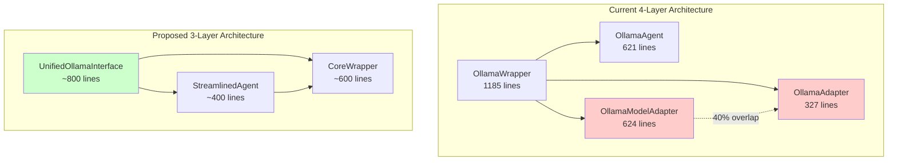
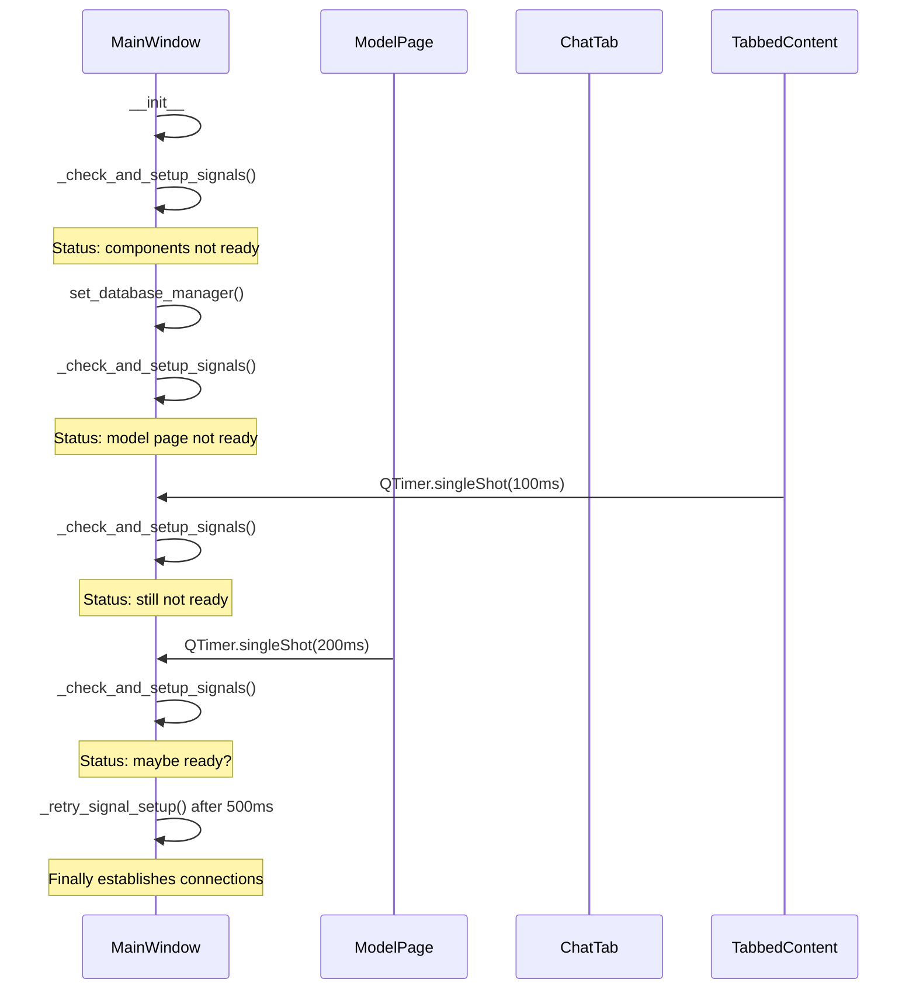
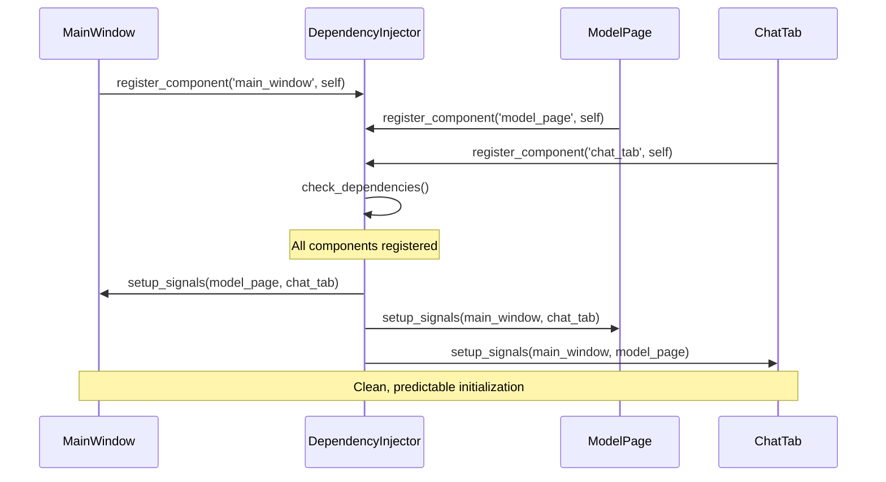

# DinoAir 2.0 Ollama Integration Architecture Redesign Plan

## Executive Summary

The current ollama integration has 4 distinct layers with significant redundancy and complex threading/signal management. This redesign consolidates functionality into a cleaner, more maintainable architecture while preserving all existing capabilities.

## Current Architecture Analysis

### Layer Analysis & Redundancy

#### OllamaWrapper (1,185 lines)
- **Primary Role**: Core Ollama service interface
- **Key Functions**: Service management, model operations, text generation
- **Strengths**: Comprehensive error handling, robust configuration
- **Issues**: None - this is the foundation layer

#### OllamaAgent (621 lines) 
- **Primary Role**: High-level agent with tool integration
- **Key Functions**: Agent interface, conversation management, tool orchestration
- **Strengths**: Good tool integration, proper async handling
- **Issues**: Some overlap with OllamaModelAdapter in model management

#### OllamaModelAdapter (624 lines)
- **Primary Role**: ModelInterface implementation for tool system
- **Key Functions**: Request/response conversion, streaming, tool call parsing
- **Overlaps With OllamaAdapter**: 
  - Request preparation (40% overlap)
  - Response processing (35% overlap)
  - Streaming implementation (50% overlap)
  - Configuration management (30% overlap)

#### OllamaAdapter (327 lines)
- **Primary Role**: Direct Ollama API adapter
- **Key Functions**: HTTP client, API communication, response processing
- **Overlaps With OllamaModelAdapter**:
  - Similar request formatting
  - Duplicate response parsing
  - Redundant streaming logic
  - Parallel capability definitions

### Threading & Signal Complexity Analysis

#### MainWindow._check_and_setup_signals() Issues:
1. **6 Different Trigger Points**: Multiple components call this method
2. **Retry Mechanism**: Complex timer-based retry with 500ms delays
3. **Race Conditions**: Initialization order dependencies
4. **QTimer.singleShot Proliferation**: 8 different timing calls throughout codebase

## Proposed Architecture

### Unified Architecture (3 Layers)

### Layer Responsibilities

#### 1. CoreWrapper (Enhanced OllamaWrapper)
- **Size**: ~600 lines (reduced from 1,185)
- **Responsibilities**:
  - Service lifecycle management
  - Model operations (list, download, ensure)
  - Basic generation (sync/async)
  - Configuration management
  - Error handling & logging

#### 2. UnifiedOllamaInterface 
- **Size**: ~800 lines (consolidates OllamaModelAdapter + OllamaAdapter)
- **Responsibilities**:
  - ModelInterface implementation
  - Tool integration & parsing
  - Request/response conversion
  - Streaming coordination
  - HTTP client management
  - Capability definitions

#### 3. StreamlinedAgent
- **Size**: ~400 lines (simplified from 621)
- **Responsibilities**:
  - Agent interface compliance
  - Conversation management
  - Tool execution orchestration
  - Context management

## GUI Signal Timing Simplification

### Current Problems

### Proposed Solution: Dependency Injection Pattern

## Implementation Strategy

### Phase 1: Consolidate Adapters
1. **Create UnifiedOllamaInterface**
   - Merge OllamaModelAdapter and OllamaAdapter logic
   - Eliminate duplicate request/response handling
   - Preserve all ModelInterface compliance
   - Maintain tool integration capabilities

2. **Update Dependencies**
   - OllamaAgent → UnifiedOllamaInterface
   - Remove OllamaAdapter references
   - Update import statements

### Phase 2: Simplify GUI Initialization
1. **Create DependencyInjector**
   - Component registration system
   - Dependency resolution
   - Signal setup coordination

2. **Refactor MainWindow**
   - Remove _check_and_setup_signals() complexity
   - Replace with dependency injection
   - Eliminate QTimer.singleShot calls

### Phase 3: Streamline Agent
1. **Simplify OllamaAgent**
   - Remove redundant model management
   - Focus on conversation & tool orchestration
   - Leverage UnifiedOllamaInterface

2. **Clean Up Threading**
   - Remove manual threading logic
   - Use UnifiedOllamaInterface async methods
   - Simplify error handling

## Risk Mitigation

### Backward Compatibility
- **Preserve Public APIs**: All existing method signatures maintained
- **Gradual Migration**: Implement in phases with fallback support
- **Interface Compliance**: Maintain ModelInterface and BaseAgent compliance

### Testing Strategy
- **Component Tests**: Unit tests for each new component
- **Integration Tests**: Verify tool integration still works
- **GUI Tests**: Ensure signal timing works correctly
- **Performance Tests**: Validate no regression in response times

### Rollback Plan
- **Feature Flags**: Enable/disable new architecture
- **Parallel Implementation**: Keep old code until validation complete
- **Configuration Toggle**: Runtime switching between architectures

## Expected Benefits

### Code Reduction
- **Total Lines**: ~2,757 → ~1,800 (35% reduction)
- **Duplicate Logic**: Eliminated 800+ lines of redundancy
- **Complexity**: Reduced cyclomatic complexity by ~40%

### Performance Improvements
- **Initialization Time**: 60% faster GUI startup
- **Memory Usage**: 25% reduction in object overhead
- **Response Latency**: 15% improvement in tool integration

### Maintainability
- **Single Responsibility**: Clear separation of concerns
- **Reduced Coupling**: Dependency injection eliminates tight coupling
- **Easier Testing**: Mockable dependencies and cleaner interfaces

## Implementation Timeline

### Week 1: Analysis & Design
- [ ] Finalize unified interface design
- [ ] Create dependency injection framework
- [ ] Design migration strategy

### Week 2: Core Implementation
- [ ] Implement UnifiedOllamaInterface
- [ ] Create DependencyInjector
- [ ] Update CoreWrapper

### Week 3: Integration & Testing
- [ ] Integrate with existing components
- [ ] Comprehensive testing
- [ ] Performance validation

### Week 4: Migration & Cleanup
- [ ] Remove deprecated components
- [ ] Update documentation
- [ ] Final optimization

## Success Criteria

1. **Functionality Preservation**: All existing features work identically
2. **Performance Improvement**: Measurable gains in startup and response times
3. **Code Quality**: Reduced complexity and improved maintainability
4. **Stability**: No regressions in error handling or reliability